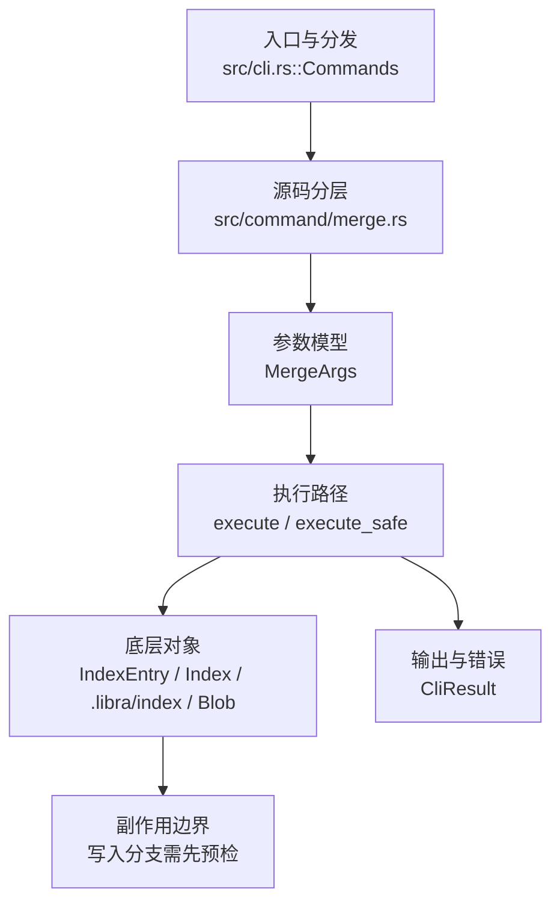

# `libra merge` 开发设计

## 命令实现目标

`libra merge` 的目标是把其他提交或分支合入当前 HEAD，覆盖 fast-forward、单头 three-way、`ours` strategy、冲突侧偏好与无关历史合并。实现需要处理冲突生命周期、autostash、rename detection、签名/策略兼容参数和 JSON 输出；`--ff`/`--ff-only`/`--no-ff`、`-s ours`、`-X ours/theirs`、`--allow-unrelated-histories`、`--log[=<n>]` 与 `merge.ff`/`merge.log`/`merge.verifySignatures` 配置默认已支持，同时把 octopus、其它 strategy/option、`--rerere-autoupdate` 和 merge-commit signing 作为未完成差异。

## 对比 Git 与兼容性

- 兼容级别：`partial`。fast-forward、单头 three-way、`-s ours`、`-X ours/theirs`、`--allow-unrelated-histories`、`--log[=<n>]`/`--no-log`、冲突 lifecycle、autostash、历史 config 与现有签名/显示 flags 已支持；octopus、其它 strategy/option、`--rerere-autoupdate` 与 merge-commit signing 延后。
- three-way 冲突仍由 `merge_tree_items` + `diffy` 行级合并处理；`-X` 只替换冲突 region，clean hunk 继续合并。`--dry-run` 仍在首次持久写前返回，strategy/option 与虚拟空 base 都只在内存计算；JSON `strategy` 对 `-s ours` 为 `ours`，真实输出不新增其它 schema key。
- `--restart` 继续对记录的 `state.target` 确定性重跑；recovery-critical 的 `allow_unrelated_histories` 从 fsynced state 重放，其它原始展示/策略 option 仍使用默认。`--no-commit` 的干净 state 继续由 `RestartWithoutConflicts` 拒绝。
- P1-07b 实现边界：`MergeStrategy::Ours` 记录双父并复用当前 tree；`MergeFavor::{Ours,Theirs}` 对 add/add、modify/delete 和内容冲突统一选侧，内容冲突使用不可与输入碰撞的动态 marker 只抽取冲突区段。LCA 缺失且显式允许时使用空 item map，`MergeState.base: Option<String>` 的 `None` 表达虚拟 base，不写伪对象。

- 当前矩阵明确仍是部分兼容；未覆盖的 Git surface 必须显式列在“还未实现的功能”。

## 设计方案

- 入口与分发：已公开接入 `src/cli.rs::Commands`；已由 `src/command/mod.rs` 导出。CLI 层在 `src/cli.rs` 把解析后的参数交给命令模块，命令模块负责把领域错误转换为 `CliError` / `CliResult`。
- 源码分层：主要实现文件为 `src/command/merge.rs`。参数/子命令类型包括：`MergeArgs`；输出、错误或状态类型包括：`PullMergeSummary`（别名 `MergeOutput`）、`PullMergeError`（别名 `MergeError`）、`MergeState`；主要执行函数包括：`execute`、`execute_safe`。
- 执行路径：`execute_safe` 负责 CLI 安全包装、错误映射和输出配置；索引路径会加载、比较、刷新或保存 `.libra/index`；对象路径会解析 revision 并读写 blob/tree/commit/tag 等对象；引用路径会读取或更新 SQLite refs、HEAD 与 reflog；数据库路径会通过 SeaORM/SQLite 或 D1 客户端持久化元数据。

- 流程图：以下流程图按当前源码分层展示主路径和底层对象边界，便于维护者把代码入口、执行函数和副作用范围对应起来。

- 底层操作对象：`IndexEntry`（索引条目，承载路径、mode、object id 和 stat 元数据）；`Index` / `.libra/index`（暂存区状态、路径条目和刷新/保存边界）；`Blob`（文件内容或 LFS pointer 写入对象库后的 blob 对象）；`Commit`（提交对象、父提交关系和提交消息载荷）；`TreeItem` / `TreeItemMode`（tree 中的路径项和 mode）；`Tree`（由索引或对象遍历生成的目录树对象）；`Branch` / branch store（SQLite refs 上的分支读写、过滤和上游关系）；`Head`（SQLite 中的 HEAD 指向、当前分支和 detached 状态）；`ReflogContext` / `with_reflog`（SQLite reflog 写入和动作记录）；`DatabaseTransaction`（需要原子性的数据库写入事务）；SeaORM / `.libra/libra.db`（配置、refs、reflog、AI/发布元数据等 SQLite 表）；`ObjectHash`（SHA-1/SHA-256 对象 ID 和 revision 解析结果）
- 输出与错误契约：人类输出、`--json` / `--machine` 输出和 quiet/verbose 分支必须继续走现有 `OutputConfig` / `emit_json_data` / `CliError` 路径；新增失败模式要补稳定错误码、用户提示和回归测试。
- 副作用边界：凡是写入索引、对象库、refs/HEAD、reflog、SQLite/D1、工作树或远端的路径，都必须先完成参数校验和 dry-run/预检分支，再执行持久化，避免部分写入后静默成功。
- Hook 边界：`pre-merge-commit` 经 `internal::repo_hooks` required sandbox 在自动 merge commit 前 blocking 运行；随后 `prepare-commit-msg`/`commit-msg` 通过精确可写的 `.libra/COMMIT_EDITMSG` 修改 merge 消息。每个 blocking hook 后都再次校验工作树与 untracked overwrite，避免 hook 修改在 ref 更新后才被覆盖。commit/ref 更新与 reset 成功后 advisory `post-commit`，共享 pull wrapper 再为成功 merge/fast-forward/squash advisory 运行 `post-merge`。`--no-verify` 写入 `MergeState.skip_hooks`，因此全部 merge lifecycle hooks 可跨冲突继续并由 `merge --continue --no-verify` 显式覆盖。

### 递归虚拟祖先（plan-20260903 MG-02 / ADR-MG-04）

- **入口判定**：`merge_base_commits`（原 `lca_commit`）返回 `merge_base::merge_bases` 的**全集**（升序 hex），不再只取第一个。up-to-date / fast-forward / `--ff-only` 三个判定改写在**集合**上（`merge_is_up_to_date`、`merge_head_is_sole_base`、`merge_is_fast_forward`）：某侧是另一侧祖先时它支配全部共同祖先，因此这三种形态恰好等价于「唯一 base 且等于该侧 tip」；多 base 必然是真分叉，永不 ff。`preflight_merge_gitlinks` 与引擎共用同一组判定（GC-02）。
- **gitlink 前置 gate 先于折叠**（MG-00 → MG-02 依赖边）：`ensure_merge_gitlinks_uniform` 对**每一个** merge base 各跑一次 MG-00 的 `ensure_gitlinks_not_arbitrated`。两个 base 之间对某 gitlink 不一致时，折叠自身就会去裁决它——因此逐 base 校验既是「所有输入一致」的等价表述，又保证 fail-closed 发生在折叠写任何对象**之前**。折叠内部因此永远看不到需要裁决的 gitlink，item map 里也不含 gitlink（由 pass-through 集合单独承载）。
- **折叠算法**（`virtual_merge_base` → `fold_merge_bases`，对齐 git@`3cb9185f6` `merge-ort.c:5313`）：base 按 hex 升序两两左折；每一步的 base 由 `merge_bases_of_folded` 给出，再递归折叠。递归深度 = Git 的 `call_depth`（用户的合并为 0，折叠 base 的合并为 1，折叠「base 的 base」为 2……）。
- **`merge_bases_of_folded` 为什么不读虚拟提交**：Git 用 `make_virtual_commit` 串起虚拟提交，下一轮再对它调 `get_merge_bases()`。本实现改为从**真实** base 推导——虚拟祖先的可达集恰好是它们可达集的并，故 `common(virtual, next) = ⋃ᵢ (anc(baseᵢ) ∩ anc(next))`，而并集的极大元必在各部分极大元之中，即 `⋃ᵢ merge_bases(baseᵢ, next)` 再跨部分做支配过滤（`merge_base::is_ancestor`）。结果集合与 Git 相同，但折叠不必把自己写出的对象再读回来，`--dry-run` 因此可以**一个字节都不写**。
- **折叠内部的判定**（`merge_virtual_items` / `virtual_conflict_resolution`）：虚拟祖先是合成输入，折叠必须总能产出内容，所以它不上抛冲突。逐条对齐 git@`3cb9185f6`：
  - `-X ours/theirs` 在 `depth > 0` 一律关闭（`merge-ort.c` 在 `call_depth` 非 0 时置 `ll_opts.variant = 0`）；
  - change/delete（仅单侧存活）取 base 版本（`merge-recursive.c` `handle_change_delete`：「reuse the base version for virtual merge base」）；
  - 两侧**类型不同**（`S_IFMT` 不同，Git 的 `handle_content_merge` 直接 assert 同类型）或两侧都是符号链接：取 base 条目——`merge-ort.c` 在 `call_depth` 下 `result->mode = o->mode; oidcpy(&result->oid, &o->oid)`，**无 base 即该路径在祖先中不存在**；
  - 任一侧是二进制（`merge_input_is_binary`：Git `merge-ll.c` `ll_xdl_merge` 的两条判据——`xdiff-interface.c` `buffer_is_binary` 前 8000 字节含 NUL，或输入超过 `xdiff/xdiff.h` `MAX_XDIFF_SIZE` = 1023 MiB，Codex R6）：取 base 的**内容**，无 base 时取**空 blob**——`merge-ll.c` 的 `ll_binary_merge` 在 `virtual_ancestor` 下 steal `orig`，而 `read_mmblob` 读 null oid 得到空缓冲；记空 blob 而非「不存在」，是为了不把外层的 add/add 降级成单侧新增；`try_merge_blob_contents` 在 `depth > 0` 遇二进制直接返回 `None` 把判定让给这条规则（depth 0 的行为**未改动**，那是另一条轴）；
  - 其余（两侧同为普通文件、非二进制）按当前 `merge.conflictStyle` 渲染成带标记的内容并落为 blob；base 类型与两侧不同的情况按 Git 的 `two_way` 当作无 base 做两路合并（mode 规则仍看真实 base）；
  - mode 取 Git 的 `merge_mode_and_contents` / `handle_content_merge` 规则（`virtual_merged_mode`：两侧同 mode 或 ours 未改 → 取 theirs，否则取 ours）。
  - 配套：`relabel_conflict_markers` 改为**逐字节**改标签（原先经 `String::from_utf8_lossy`），因为折叠会处理「Git 判为文本但非 UTF-8」的内容，lossy 转换会把这些字节改写成 U+FFFD。
- **标记宽度随深度**：`conflict_marker_length_at_depth = unambiguous_conflict_marker_length(sides) + 2 × depth`——Git 的 `DEFAULT_CONFLICT_MARKER_SIZE + call_depth * 2`（`merge-ort.c` 传 `extra_marker_size`，`ll_xdl_merge` 相加）叠加 Libra 既有的「按内容加宽」。深度 0 与改动前完全一致。折叠内的标记标签用 Git 的 `Temporary merge branch 1/2`（`relabel_conflict_markers` 增加 `ours_label` 参数，外层仍是 `HEAD`/commit 缩写）。
- **一次性对象与 GC**（ADR-MG-04）：`materialize_virtual_ancestor` 在 `persist`（即非 `--dry-run`）时把折叠结果写成 tree + 合成 commit，parents = 到目前为止折叠过的**真实** base（可达集与 Git 的链式虚拟提交一致），author/committer 为确定性的 `Libra <virtual-merge-base@libra.invalid>`、时间戳取 parents 的最大 committer 时间、时区 `+0000`——所以同一段历史每次折叠出的对象 id 相同。它**不进 `merge-state.json`**：`recorded_merge_base` 只在「唯一真实 base」时写 `base` 字段，因此 `merge_state_gc_oids` 不会把虚拟对象登记成 GC root，`maintenance gc` 可以在冲突合并进行中回收它们而不触发 sidecar 的 fail-closed 悬空判定；恢复只走 `--restart` 重算（`--continue` 从索引收尾，本就不需要 base 对象）。折叠合成的 **blob** 另有一份内存副本（`VirtualBlobs`，`load_merge_blob` 优先命中），这是 `--dry-run` 不写对象仍能算出同一结果的原因；真实合并里它们同时落盘，并由冲突路径的 stage-1 索引条目充当 GC root。
- **`merge_bases_of_folded` 的工作量**（Codex R3）：`internal::merge_base` 只暴露逐次调用的 API（每次新建图读取源，MG-01 的有意设计，本卡只消费不改），所以第 `k` 步折叠要做 `k−1` 次 merge-base 染色；单个已折叠 base 时直接返回 `merge_bases`（不做任何支配过滤——单一部分的结果本就互不支配），多部分时只在**不同部分**的候选之间做 `is_ancestor`。宽度由 `MAX_VIRTUAL_ANCESTOR_BASES = 32` 封顶（`ensure_virtual_ancestor_width`），在**三处**生效（Codex R4）：`merge_base_commits` 拿到裸 id 后、加载任何 base commit/tree 之前（`will_fold` = `merge_options_will_fold`：默认策略且非 `--ff-only`；`-s ours` 不折叠、分叉的 `--ff-only` 先以 NonFastForward 拒绝，两者都不受宽度限制——Codex R5）；`fold_merge_bases` 入口；`merge_bases_of_folded` 内对已折叠 base 数以及**逐个收集候选时**的候选数——候选超限即拒绝，不做任何两两 `is_ancestor`。超限报 `VirtualAncestorTooWide`→`LBR-UNSUPPORTED-001`；深度上限管嵌套、宽度上限管一层的 base 数与候选数，两者合起来才是确定性的工作量上界。端到端：`merge_crisscross_more_bases_than_the_width_ceiling_is_refused_before_loading`（33 个独立祖先，拒绝且零写入，`-s ours` 放行）。
- **与 Git 的已知差异（五项，用户文档与 `COMPATIBILITY.md` 同步登记）**：⓪ 同层 base 数上限 32（Git 无上限；见上一条）；① 折叠顺序固定为 hex 升序，Git 用 `get_merge_bases()` 的遍历顺序——≥3 个 base 且折叠不可交换时结果可能与 Git 不同（换来的是可复现，`--restart` 才能重算出同一个祖先）；② 递归深度上限 20（`MAX_VIRTUAL_ANCESTOR_DEPTH`），超限报 `LBR-UNSUPPORTED-001`，Git 无上限；③ 多 base 时 `merge.conflictStyle` 提前解析（折叠内容依赖它），因此非法值会拦下一个本来会干净完成的交叉合并；④ 合成 commit 的 parents 是「全部已折叠真实 base」而非 Git 的两两链式，可达性等价、对象 id 不同。

### 增量树合并：目录剪枝（plan-20260903 MG-03）

- **问题**：`commit_tree_split` → `TreeExt::get_plain_items_with_mode` 把三棵树全量拍平成 `HashMap<PathBuf, MergeTreeEntry>`，每次合并读取三侧**全部** tree 对象（O(全树)），与改动量无关。
- **新路径**（`perform_incremental_three_way_merge` / `incremental_merge_trees` / `incremental_merge_walk`，对齐 git@`3cb9185f6` `merge-ort.c:1259` `collect_merge_info_callback` 的判定形状）：三棵树按目录**同步下降**，每个目录先比三侧 tree id 再决定是否打开——三侧一致不打开；一侧等于 base 则**整体采纳**另一侧的子树（结果里是一条 `TreeItemMode::Tree` 条目，`create_tree_from_items_map` 原样写入，不展开）；两侧同改一致采纳；单侧新增/删除按 id 决定；其余才递归。叶子仍走 `resolve_three_way`，因此两条路径对每个文件的判定**相同**（`merge::tree::incremental_and_flattening_paths_agree*` 逐叶对拍，含 mode/symlink/exec/目录换文件/add-add/modify-delete）。
- **读取面**（`TreeSource` trait；生产 `ObjectStoreTrees` 每 id 读一次并计数，单测用计数的内存图）：三侧一致的子树永不打开；「一侧等于 base」的子树只在**另一侧不同的路径上**逐层打开——`files_changed` 计数用一次剪枝 diff（`pruned_subtree_diff`：只打开 id 不同的目录，每层每侧一次）。`a_subtree_only_we_changed_is_adopted_with_only_the_gates_reads` 钉住「三个根 + 只读 gate 沿差异链每侧每层一次（4 层 × 2 个不同的侧 = 8），合并 walk 本身零新增读取、零 blob 读取」；`pruned_subtrees_are_not_read` 钉住「共享子树零读取 + 采纳子树只沿差异路径（3 + 8）」；`synthetic_large_tree_reads_scale_with_changes_not_size` 在 10^5 文件 / 1% 改动的合成树上断言读取数 ≤ 根 + 差异目录×2 侧，且不足全树 tree 数的一半。
- **ADR-MG-01 在剪枝下的两档 —— 独立的只读 gate 先行**（Codex R1；CLI 级用例 R7 补齐：`merge_gitlink_nested_changed_pointer_inside_a_pruned_subtree_is_refused` / `merge_gitlink_nested_identical_pointer_inside_a_pruned_subtree_passes_through`——gitlink 埋在 ours 与 base 相同的 `deps/vendor/` 之下，theirs 改指针即拒绝且零写入，三侧相同则随剪枝子树原样通过、stats seam 证明 `deps/` 从未打开）：`incremental_gitlink_gate` / `gitlink_gate_walk` 在合并 walk **之前**跑一遍只读遍历：三侧 id 相同的目录不打开（内部不可能有分歧），其它目录在每个持有它的侧打开——新增/删除的子树因此被完整枚举（那正是被合并的改动本身）；遇到 gitlink 条目，**三侧齐全且相同**才算 pass-through，否则登记为裁决；全部裁决路径排序后报最小者（与拍平路径 `ensure_gitlinks_not_arbitrated` 的选择一致）。这条规则与拍平路径逐点等价，且覆盖所有快捷采纳臂（`b==o`/`b==t`/`o==t`/单侧新增/单侧删除）——它们不再各自扫描。gate 先于 walk，所以 walk 里 `persist_merged_blobs` 写出的自动合并 blob 绝不会在被拒绝的合并里落盘；两者共用同一个 `ObjectStoreTrees`，walk 打开的目录 gate 已缓存，对象库读取不重复。`preflight_merge_gitlinks`（单/无 base）同样改用该 gate（不再 `commit_gitlink_entries` 拍平），多 base 保留 `ensure_merge_gitlinks_uniform`。用例：`gitlinks_inside_pruned_subtrees_follow_adr_mg_01`（共享子树零读取放行 / theirs 改隐藏指针拒绝 / 可见新增拒绝）+ `merge_gitlink*` 全部集成用例默认经剪枝路径。
- **消费者与写入顺序**（Codex R5）：干净路径只需要树（采纳子树原样写入），索引/工作树由 `reset_index_and_workdir_to_tree` 从最终 tree 重建——这是合并躲不掉的唯一一次全量读取（Git 亦然）。增量路径把这次检出**提前到 commit 与 HEAD 写入之前**：`rebuild_index_from_tree` 在保存索引前就读完结果树携带的全部 tree/blob，因此缺失/损坏的对象（含 walk 未打开、HEAD 自有的共享 tree）在 HEAD、索引、工作树与 merge-state 都未改动时失败——拍平路径靠「拍平时读遍」得到的这层保护，这里由写入顺序给出。精确口径（Codex R7）：在此之前已经落盘的只有**内容寻址的对象**——`create_tree_from_items_map` 写出的结果 tree 与 walk 里自动合并的 blob——它们在失败时无任何引用、可被 `maintenance gc` 回收，与拍平路径在同一时点写出的对象完全相同；「零持久写入」指的是引用/索引/工作树/状态面。崩溃窗口随之改变：拍平路径是「commit+HEAD 已写、树未检出」，增量路径是「结果已检出并暂存、HEAD 仍旧、无 merge-state」（表现为已暂存改动，commit 或 reset 即可恢复；Git 同样先写索引/工作树）。hook 仍在检出之前运行（否则 hook 之后的 `ensure_clean_status` 会把已暂存的结果判为脏）。冲突路径需要逐文件索引条目与工作树文件，故 `expand_adopted_subtrees` 把**所有**携带的子树展开成叶子（冲突索引列出每个文件）——冲突路径的读取量因此是 O(全树)，与拍平路径相同；剪枝的收益在判定与干净路径；未跟踪碰撞检查（`adopted_aware_write_paths`）只考虑**结果引入的**子树（采纳自 theirs 或 theirs 新增，`IncrementalMergeResult::adopted_from_theirs`）——ours 本就拥有的子树（三侧一致或 ours 自有）不写任何文件，其下的未跟踪路径不会被覆盖，故不展开（一个巨大的未改动子树即使下面有未跟踪文件也不会被打开，Codex R8；stats 端到端用例在 `shared/` 下放了未跟踪文件仍守住读取界）；对引入的子树先用 `worktree::paths_conflict` 做**对称**前缀筛（未跟踪文件 `p` 与采纳目录 `p/q` 也算碰撞，与拍平路径逐叶 `paths_conflict` 一致），只有命中时才展开该目录再走原有 `ensure_no_untracked_conflicts`；该计算在**每个**检查点（合并前、`pre-merge-commit` 之后、消息 hook 之后）按当时的未跟踪集合重算，hook 在采纳目录下新建的文件因此不会漏判（Codex R2）。`files_changed` 由 walk 累计：叶子按「结果 ≠ ours」计数，冲突路径按「ours 有条目」计数（与 `count_item_map_changes(ours, merged)` 完全一致），采纳子树用剪枝 diff 计数。
- **适用范围与开关**：单 base 与无 base（unrelated）走新路径；多 base（MG-02 递归虚拟祖先）保留拍平路径——它构造虚拟祖先时已读全三侧，拍平不再增加读取。`LIBRA_TEST=1` + `LIBRA_TEST_MERGE_TREE_WALK=flat` 强制旧路径（与 `am`/`stash` 失败点同一哨兵形状；`incremental_tree_walk_enabled_for` 纯函数钉住：无哨兵时 `flat` 无效），供对拍与回归；旧拍平实现按卡内约定保留，下线随 DEFER-05。
- **未打开 tree 的不变量（取代 R3 的写前逐 tree 校验，Codex R4）**：结果里按 id 携带、而 walk **未打开**的每个 tree，都已被 `ours`（HEAD）引用——gate 会递归进入三侧不全相同的每个目录，因此它没打开的目录在所有在场侧（含 ours）id 相同；采纳自 theirs 的子树内部同理（gate 只在 theirs 的嵌套 tree 等于 base 的、而 base 等于 ours 处停下）；新增目录没有对侧，被完整枚举。所以增量路径**不可能**引入一个拍平路径本会发现的不可读 tree：walk 没打开的 tree 若缺失，那是已检出提交本身的损坏，两条路径都在检出时同样失败。基于此不再做「读遍采纳子树」的校验（那会把读取量退回到仓库规模）；`merge::tree::unopened_trees_are_heads_own` 钉住该不变量，`merge_tree_walk_refuses_an_added_subtree_with_a_missing_nested_tree` 钉住「新增子树的嵌套 tree 缺失在任何写入前被 gate 发现（`LBR-REPO-002`）」。**`--dry-run`**（Codex R8/R9）：真实合并由检出读遍携带的 tree 并在写入前失败，预演没有检出，因此自己做一次只读探测（`probe_carried_trees_readable`：以**真实合并会用的视角**读携带子树下的全部 tree（只读 tree 不读 blob）：无冲突时真实合并会检出，检出经 `load_object` 应用嵌套 `refs/replace`，故预演用 `ObjectStoreTrees::as_checkout_sees_them()`；有冲突时真实合并不检出、而是经 walk 的 raw 源展开子树写冲突状态，故预演也用同一 raw 源（Codex R11：否则「别处冲突 + 悬空的嵌套 replace」会让预演报 `TreeLoad` 而真实合并成功写出冲突状态）；walk 与 gate 仍是 raw 视角、与拍平路径一致，两种视角各自成源、不混缓存）——预演结论与真实合并一致，代价即拍平路径的预演本就要读的那批 tree（`merge_tree_walk_dry_run_matches_the_real_verdict_on_a_missing_shared_tree`、`merge_tree_walk_dry_run_follows_nested_replacements_like_the_checkout`、`merge_tree_walk_conflicted_dry_run_matches_the_real_conflict_path_under_a_dangling_replace`）。
- **`refs/replace` 口径**：拍平路径对**根** tree 用 `load_object`（应用 replace）、对嵌套 tree 用 `Tree::load`（不应用）；增量路径逐点对齐——根 id 经 `replace::resolve`，`ObjectStoreTrees` 用 `load_object_raw` 读嵌套 tree，两路径看到并记录同一批 id（合并输入是否应一致地尊重 replace 是另一条轴，本卡只保证两路径一致）。
- **G6–G8 的 CLI 承载**（Codex R9）：`merge_tree_walk_preserves_a_mode_only_change_on_both_walks` / `merge_tree_walk_preserves_a_symlink_change_on_both_walks` / `merge_tree_walk_preserves_an_added_executable_on_both_walks`——theirs 一侧用 plumbing（`update-index --cacheinfo` + `write-tree` + `commit-tree`）构造，因为 porcelain `add` 不识别裸 `chmod`（mode-only 改动在 `status`/`add` 里不可见，与本卡无关的既有限制）；每个用例在默认与 `flat` 两种 walk 下各跑一遍，断言合并后 `ls-tree -r HEAD` 与 `ls-files -s` 的 mode（100755 / 120000，符号链接指向新目标 blob），并断言两种 walk 留下**相同**的工作树。
- **已登记残留（本卡外，两条路径相同）**：merge 的检出写工作树时（`reset_workdir_tracked_only` → `write_workdir_file`）**不**应用可执行位、也**不**重写已存在的符号链接目标（tree 与索引正确；`libra checkout` 的写入器会应用）。先于本卡存在、与 walk 无关（上述三个用例在两种 walk 下测得完全相同的工作树形态），属 merge 检出写入器这条轴，不在树合并性能卡内修；待独立立卡或随后续检出收敛处理。
- **可度量的复杂度界**：合并判定（gate + walk + 剪枝 diff）的 tree 读取数 ≤ Σ 每个改动路径的目录深度 × 不同的侧数，preflight 与引擎各一遍（各自缓存）——即 O(改动路径 × 深度 × 侧数) × 2，与仓库大小无关（`synthetic_large_tree_reads_scale_with_changes_not_size` 与 stats 端到端用例按此界断言）；检出与冲突路径仍是 O(全树)。
- **不变量**：merge-state schema 不变；JSON `files_changed`/`conflicted_paths` 不变；`--dry-run` 零写入不变（采纳子树不写、剪枝 diff 只读）。**对拍精度**：两路径对每个**叶子**的判定相同；被原样采纳的子树内若含空 tree，会随子树保留（拍平路径只产出叶子、从不重建空 tree）——这是 Git 亦有的「采纳即原样」语义，登记为已知差异而非缺陷。
- **生产入口的证据 seam**：`LIBRA_TEST=1` + `LIBRA_TEST_MERGE_TREE_STATS=<file>` 时，`perform_incremental_three_way_merge` 把 `{"walk":"incremental","tree_reads":N}`（拍平路径写 `{"walk":"flat"}`）写到该文件；`N` 是进程内**全部** `ObjectStoreTrees` 对对象库的 tree 读取**尝试**数（`MERGE_TREE_STORE_READS`，失败的读取同样计入；失败退出不写 stats，因为引擎在出口才写），在引擎每个**出口**（预演返回、冲突返回、squash/no-commit/干净路径的检出之前）写出——即在最后一个读源的消费者（未跟踪复检、冲突展开、预演探测）之后；preflight gate 与引擎各一遍、各自缓存，故整个合并的界是「每遍 ≤ 根 + 差异路径 × 侧数」的两倍；端到端用例据此断言**默认合并**确实走了剪枝路径且读取数受改动路径约束，而不只靠内存图单测。

### --autostash（lore.md 1.8）

- 合并属主状态机（非 pull 的 push/pop 包裹）：`stash::create_held_stash_commit`（tracked-only，写 stash 提交对象与已落盘的 index-parent tree 但**不入 refs/stash**）→ sidecar `merge-autostash.json`（原子+fsync，MERGE_AUTOSTASH 模拟；held 提交仅由此文件可达，`maintenance gc` 将其作为 fail-closed reachability root）→ 硬重置 → 合并。统一 finalize（每个动作后运行）：无 merge-state → 回贴（干净→以独立 three-way merge 恢复 staged index 与 unstaged worktree 后删 sidecar；冲突→`store_stash_commit` 提升入 stash list + 通知，写工作树前完成冲突/碰撞预检，并保留纯添加 vs 未跟踪文件碰撞守卫；其它错误→警告+保留 sidecar，合并结果不变）；有 merge-state → held。`--restart` 以 `preserve_held_autostash` 跳过陈旧回收（否则 held stash 会被误降级）。陈旧 sidecar（崩溃残留）在下次合并启动时提升入 stash list（警告注明可能与已回贴内容重复）。配置 `merge.autostash` git-bool，非法值硬错误；`--dry-run` 下配置启用被静默抑制（dry-run 零写入契约）。`libra commit` 不终结合并（Libra 需 `merge --continue`，故 sidecar 不会被普通 commit 触发回贴）；并发合并进程间 sidecar 无锁（与 merge-state.json 同级暴露）。

## 实现历史

- 2026-09-05（plan-20260903 MG-03）：三路树合并从全量拍平改为目录剪枝的增量遍历（见「设计方案 › 增量树合并」）。回归 target：`--lib merge::tree`（读取计数 / 两路径对拍 / 开关 / 剪枝下 gitlink 两档 / 10^5 文件 benchmark）、`command::merge_test::`（全部既有用例默认走新路径，另以 `LIBRA_TEST_MERGE_TREE_WALK=flat` 复跑对拍）。

- 2026-09-04（plan-20260903 MG-02）：多 merge base 的递归虚拟祖先落地（见「设计方案 › 递归虚拟祖先」）。`merge_base_commits` 返回全集，三个 ff/up-to-date 判定改写在集合上；`ensure_merge_gitlinks_uniform` 把 MG-00 的 gate 扩到每个 base 且排在折叠之前；`TreeMergeContext` 把 persist/favor/depth/虚拟 blob 收成一个上下文穿过 `merge_tree_items` → `resolve_three_way` → `try_merge_blob_contents` → `load_merge_blob`。回归 target：`command::merge_test::merge_crisscross*`（干净折叠 / 冲突 / 单 base 不变 / 无关历史不变 / `--restart` 重算 / gc 回收后 `--restart` 恢复 / 旧 state schema / `--dry-run` 零写入）与 `--lib merge::recursive`（折叠顺序、深度上限、标记宽度、change/delete 与二进制回退、mode 规则、state 不记录虚拟 base）。

- 2026-07-31：修复所有 merge commit 的身份写错。三处 merge commit 构造点（三方合并、`--no-ff`/`-s ours`、`--continue`）此前都走 `Commit::from_tree_id`，该构造函数把 author 与 committer 硬编码为 `mega <admin@mega.org>`，导致配置的 `user.name`/`user.email` 与 `GIT_AUTHOR_*`/`GIT_COMMITTER_*` 被静默丢弃（仓库历史里多个 merge commit 因此署名错误）。改为新增 `build_merge_commit`，经 `commit::create_commit_signatures` 解析身份，与 `libra commit` 同源；无身份时以新增的 `PullMergeError::IdentityMissing` 失败，映射到与 `CommitError::IdentityMissing` 相同的 `AuthMissingCredentials` 与配置提示（`pull` 侧同步补 match 臂）。同批放开 `--continue` 的 `-m`：Libra 的 merge 从不打开编辑器，冲突合并的消息此前完全不可达，`-m` 覆盖 merge 开始时记录的 `MergeState.message`，未给时行为不变。回归 target：`command_test` 的 `test_merge_commit_carries_configured_identity`（覆盖三条路径）与 `test_merge_continue_accepts_message_override_and_configured_identity`。
- 2026-07-14（plan-20260708 P1-10）：新增 sandboxed `pre-merge-commit` → `prepare-commit-msg` → `commit-msg` → advisory `post-commit` / `post-merge` 与 `--no-verify`；覆盖自动 three-way/ours/continue、fast-forward、squash、消息修改、blocking 原子性、post failure 不回滚及 pull 共享路径。回归 target：`compat_libra_hooks_lifecycle`。
- 2026-07-10（plan-20260708 P1-05b）：新增 `history_config` 严格级联解析，`merge.ff=true|false|only`、`merge.log=true|false|<n>`、`merge.verifySignatures=true|false` 在任何 merge 写入前解析；CLI `--ff`/`--no-ff`/`--ff-only` 与正反签名 flag 优先。自动 merge message 通过 `merge_message` 追加目标侧 subject shortlog，显式 `-m` 抑制。回归 target：`compat_config_history_defaults`。同片 codex review 收口四项：签名验证提升到 `run_merge_for_pull_with_options` 顶部（目标解析+验签先于 stale-sidecar 恢复与 autostash 对象写入，验签对象即合并对象，pull 路径恒不验签）；`MergeState` 新增可选 `message` 字段（serde 默认，旧 state 兼容），冲突与 `--no-commit` 路径持久化解析后消息、`--continue` 原样重放（`-m`/shortlog 不再丢失）；`ff_only`（flag 或 `merge.ff=only`）仅在 LCA 证明分叉时拒绝，可快进的 `--squash`/`--no-commit` 放行（对齐 Git）；`commit --no-gpg-sign` 的 clap help 补 `commit.gpgSign` 优先级说明并以 `commit_help_documents_gpgsign_precedence` 钉住。
- 2026-07-13（P1-07a shared autostash safety）：held-stash 的 index-parent tree 先写入对象库；终态改用 `apply_held_stash_commit` 分别 three-way 恢复 staged index 与 unstaged worktree，补 `test_merge_autostash_restores_staged_and_worktree_layers`，消除 staged-only 内容在成功后变成不可达对象的数据丢失风险。
- 2026-07-13（P1-07b non-interactive merge controls）：新增 `-s ours`、重复且 last-wins 的 `-X ours/theirs`、`--allow-unrelated-histories`、`--log[=<n>]`/`--no-log`。虚拟空 base 与 allow 位进入原子 fsynced merge state，冲突可 restart/continue；显式 `-m --log` 的解析后消息跨 continue 保持。回归 target `compat_noninteractive_history_controls` 扩展至 21 项（含 `-s ours --no-commit` → `--continue`），并补 marker-like/no-final-newline 的选侧单测与旧 merge-state schema 兼容单测。

- 本节依据本地 main 分支提交历史重写，筛选与该命令实现、测试或文档路径直接相关的提交；以下是归纳后的实现脉络。
- 2026-05-23 `9b01fe78`（`feat(merge): wire MERGE_EXAMPLES into clap after_help (v0.17.814)`）：基础实现节点：wire MERGE_EXAMPLES into clap after_help (v0.17.814)；当前实现的主要轮廓可追溯到该提交。
- 2026-06-06 `0c7604f9`（`feat(pull): forward merge flags + depth, gate unsupported rebase strategies (#1388)`）：功能演进：forward merge flags + depth, gate unsupported rebase strategies (#1388)；该节点扩展了当前命令可用的参数或行为。
- 2026-06-03 `f4994c4f`（`feat: improve merge handling and embedded libra skill`）：功能演进：improve merge handling and embedded libra skill；该节点扩展了当前命令可用的参数或行为。
- 2026-06-07 `564cff05`（`fix(merge): close compatibility plan gaps`）：实现修正：close compatibility plan gaps；该节点把边界行为、错误处理或兼容差异纳入当前实现约束。
- 历史结论：当前文档应以这些提交之后的代码、测试和兼容矩阵为准；更早的迁移式文档只保留为背景，不再作为事实来源。

## 当前状态

- 历史默认值：`merge.ff=true|false|only`、`merge.log=true|false|<n>`、`merge.verifySignatures=true|false` 按 local→global→system 严格级联读取；对应 CLI flag 优先，无效/不可读 local/global 值在副作用前失败。`--ff` 已公开用于覆盖 `merge.ff=false|only`。`ff_only`（flag 或 `merge.ff=only`）仅拒绝真正分叉的历史，可快进的 `--squash`/`--no-commit` 放行；解析后的 merge 消息持久化于 `MergeState.message`（可选字段，旧 state 回退普通格式），`--continue` 原样重放；签名验证在目标解析后、autostash/恢复变更前执行。

- 公开状态：已公开；模块状态：已导出。
- 用户文档：`docs/commands/merge.md`。
- 冲突状态持久化（`lore.md` §7.7）：`MergeState.save` 经 `utils::atomic_write::write_atomic`（临时文件 → fsync → rename → fsync 父目录）原子且 fsync 写 `.libra/merge-state.json`——崩溃只会留下完整或缺失的 state，绝不残留半截文件破坏 `--continue`/`--abort` 恢复。
- Synopsis：`libra merge [--ff | --ff-only | --no-ff] [-s ours | -X ours/theirs] [--allow-unrelated-histories] [--log[=<n>] | --no-log] [--squash | --no-commit] [-m <msg>] [--no-verify] [--verify-signatures | --no-verify-signatures] [--dry-run] <branch>` / `libra merge --continue [-m <msg>] [--no-verify]` / `libra merge --abort` / `libra merge --restart`。
- 公开参数/子命令包括：`<branch>`、`--continue`、`--abort`、`--ff-only`、`--no-ff`、`-m, --message <MSG>`、`--squash`、`--no-commit`、`--no-edit`（接受为 no-op，Libra 从不为 merge 打开编辑器，行为等同默认；不提供 `--edit`）、`--stat`/`-n`/`--no-stat`（last-wins 切换：`--stat` 在合并完成后打印「合并前 HEAD↔新提交」的 diffstat（经 `command::diff::diff_stat_between_commits` 复用 `diff --stat` 渲染，仅人类输出，up-to-date/aborted/冲突/squash-no-commit 不打印）；`--no-stat`/`-n` 与默认不打印）、`--no-progress`（接受为 no-op：Libra 的 merge 从不渲染进度条；`no_progress` 字段解析后不被读取）、`--verify-signatures`（在 `run_merge_for_pull_with_options` 顶部、任何 autostash/恢复变更之前解析被合并 tip、调 `commit::verify_commit_signature` 重建签名内容并经 `vault::pgp_verify` 校验，已加载的 commit 直接传入合并——验签对象即合并对象；未签名→`UnsignedMergeCommit`、校验失败→`BadMergeSignature`，均在写任何内容前中止。仅能验证本仓库 vault PGP key 所签，无外部 keyring，故他处签名/SSH 签名视为不可验证。pull 路径恒传 `verify_signatures=false`）、`--no-verify-signatures`（默认；与 `--verify-signatures` 组成 `overrides_with` toggle，`no_verify_signatures` 字段解析后不被读取）、`--no-rerere-autoupdate`（接受为 no-op：Libra 无 rerere，无可更新；`no_rerere_autoupdate` 字段解析后不被读取。Git 的反向 `--rerere-autoupdate` 未公开）、`--no-gpg-sign`（接受为 no-op：Libra 的 merge 从不签名；`no_gpg_sign` 字段解析后不被读取。Git 的 `-S`/`--gpg-sign` 未实现）、`--dry-run`（Libra 扩展：零写入预演，见「对比 Git 与兼容性」）、`--restart`（Libra 扩展：abort+确定性重跑，见同节）。
- P1-07b 参数：`-s ours` / `--strategy=ours`；`-X ours|theirs` / `--strategy-option=<...>`（可重复、最后值生效，与 `-s` 互斥）；`--allow-unrelated-histories`；`--log[=<n>]` / `--no-log`（last-wins，bare 为 20）。`-s ours` 保留整个当前 tree，`-X` 只偏向冲突区段；其它 enum 值由 clap 在副作用前以 usage error 拒绝。JSON 仅复用 `strategy`/`parents`/`files_changed` 既有字段。
- `--ff-only`：仅当当前分支可 fast-forward 到目标时才合并，否则失败（非快进退出错误）。`--no-ff`：即使可以 fast-forward 也强制生成两亲合并提交。`-m, --message <MSG>`：覆盖合并提交消息（默认 `Merge <upstream> into <head>`）。`--squash`：执行合并并把结果写入 index/worktree，但**不创建提交、不移动 HEAD、不记录 merge 信息**（永不 fast-forward），随后用普通 `commit` 收尾生成单亲提交。`--no-commit`：执行合并并暂存结果但**停在提交之前**（永不 fast-forward），写入 `MergeState`（无冲突路径），随后用 `libra merge --continue` 收尾两亲提交。**刻意差异**：与 Git 不同，`--no-commit` 后用普通 `commit` 只会记录单亲，必须用 `merge --continue` 收尾。`--squash` 与 `--no-commit` 互斥，且都与 `--continue`/`--abort` 互斥；与 `--ff-only` 可组合（P1-05b 起对齐 Git）：可快进时放行，仅真分叉被拒。这些 flag 底层复用 pull 已有的 `PullMergeOptions` 引擎路径（`message`/`squash`/`no_commit` 在 `perform_three_way_merge` 计算出 merged tree 后提前返回；`--no-commit` 复用 `merge --continue` 的 MergeState 机制）。

- gitlink（submodule）安全默认值（plan-20260903 MG-00 / ADR-MG-01 / `_compatibility.md` D24）：三路合并输入的 tree 拍平不再静默丢弃 `160000` 条目。`command::merge::split_gitlink_entries` 把 gitlink 从可合并条目中分出，`command::merge::ensure_gitlinks_not_arbitrated` 是 merge / rebase / cherry-pick **共用的唯一校验入口**（GC-02）：任一侧 object id 与 base 不同（含单侧新增/删除）→ 在 `ensure_clean_status` 之后、任何 index/worktree/merge-state 写入之前返回 `PullMergeError::GitlinkUnsupported`（rebase 为 `ReplayErrorKind::GitlinkUnsupported`，cherry-pick 为 `CherryPickSingleError::GitlinkUnsupported`），统一映射到 `StableErrorCode::Unsupported`（`LBR-UNSUPPORTED-001`），消息含路径；三侧一致则作为 pass-through 返回，`perform_three_way_merge` 在算完 `files_changed` **之后**把它们注入 `merged_items`，因此未变动的 submodule 既不进三路决策也不计入变更数。索引承载：`add_blob_index_entry` 对 `TreeItemMode::Commit` 以 size 0 直接登记（submodule 的 commit 对象不在本仓库对象库），`reset::rebuild_index_from_tree` 与 rebase 的 `rebuild_index_from_tree` 同样登记而不再分别 panic / 报错；引擎内 gate 位于 `ensure_clean_status` 之后、首次写入之前；另有三道**前置 gate**（更早，位于各入口的第一次写入之前）（`pull` 的两条集成路径继承：merge 侧共用 `run_merge_for_pull_with_options`，`pull --rebase` 侧 `rebase::run_rebase_for_pull` 单独挂同一道 gate）：merge 在 `--autostash` 之前（`preflight_merge_gitlinks`，复用 `merge_is_up_to_date`/`merge_is_fast_forward` 只对真正会裁决的三路合并生效），rebase 在 `prepare_rebase_aux` 之前、cherry-pick 在首个 pick 与 `resume_picks` 写 sequencer 行之前（两者是多步重放，改用保守的全序列一致判据 `ensure_gitlinks_uniform_across_inputs`）——引擎内 gate 晚于各入口的首次写入，只有前置 gate 能兑现「任何写入前」。工作树侧一律跳过（Libra 不 materialize submodule 工作树）。指针路径的 untracked 判定按**精确路径**匹配：目录内的文件属于 submodule 自己的检出，既不阻塞也不被删除；但恰好落在该路径上的普通文件/符号链接会被 `restore` 的目录占位替换，因此在 HEAD 移动之前以 `LBR-CONFLICT-002` 拒绝（`ensure_no_untracked_conflicts` 的 gitlink 参数、`utils::worktree::untracked_overwrite_path`）。fast-forward 另在 ref 更新**之前**调用只读的 `restore::preflight_worktree_restore_to_commit`：restore 刻意排在指针更新之后，因此它会拒绝的情形（最典型是目标树不再声明该 gitlink 而目录非空）必须提前判定，否则分支会跑到索引/工作树前面。restore 自身的 gitlink 语义不变——空占位目录清除，非空目录在改动任何其它路径前拒绝，`status::changes_to_be_staged*` 对 gitlink 索引条目跳过内容比对——否则每个 submodule 都会被判成 deleted（或在目录存在时把整个 status 拖成「无法 hash 目录」硬失败），而该判定喂给 `ensure_clean_status`，会让含 submodule 的仓库连 `switch`/`merge`/`rebase` 都跑不起来。

## 还未实现的功能

| 类别 | 未完成项 | 当前处理 |
|---|---|---|
| 兼容矩阵说明 | fast-forward、单头三方、`-s ours`、`-X ours/theirs`、`--allow-unrelated-histories`、`--log[=<n>]`/`--no-log` 及既有 merge flags 已支持；octopus、其它 strategy/option、`--rerere-autoupdate`/`-S`/`--gpg-sign` 延后 | 按当前兼容矩阵保留；实现状态变化时同步 `_compatibility.md` 和测试证据。 |
| ✅ 已实现 | 增量树合并（目录剪枝） | MG-03 落地：单/无 base 合并按目录同步下降，三侧一致不打开、一侧等于 base 整体采纳；读取数随改动路径而非全树。证据：`--lib merge::tree`。多 base 路径保留拍平（见设计方案）。 |
| ✅ 已实现 | 多 merge base（criss-cross）递归虚拟祖先 | MG-02 落地：全部 merge base 按 hex 升序两两折叠成虚拟祖先再做最终三方合并，取代「只取 hex 最小者」。证据：`command::merge_test::merge_crisscross*`、`--lib merge::recursive`。 |
| 兼容差异项 | 递归深度上限 20 / 同层 base 数上限 32 / 折叠顺序固定 hex 升序 / 多 base 时提前解析 `merge.conflictStyle` / 合成 commit parents 为全部已折叠真实 base | **有意差异**，五项逐条见「设计方案 › 递归虚拟祖先」的「与 Git 的已知差异」。深度上限是防栈溢出的硬边界（Git 无上限）；顺序固定换取 `--restart` 可重算同一祖先。 |
| 已登记残留（本卡外） | `--dry-run` 的「零写入」只覆盖 merge 自有表面（对象库/索引/工作树/HEAD/reflog/merge-state/autostash sidecar）；CLI 分发层在任何命令前做的仓库级例行维护（`src/cli.rs` 的仓库 preflight：schema 自动升级、object-index 修复、`maintenance.lock`）不在其内 | **有意不改**（Codex MG-02 R4 判定）：这是所有命令共有的分发层行为，先于本卡存在、与本卡行为轴无关，且 `src/cli.rs` 属 T-1 表面；用户文档已把预演契约的范围写明。若要让 `--dry-run` 绕过分发层维护，需单独立卡。 |
| 永久非目标 | submodule / gitlink 内容合并（`_compatibility.md` D24、ADR-MG-01） | 裁决触及即 fail-closed（`LBR-UNSUPPORTED-001`，消息含路径）；三侧一致原样带过。证据：`command::merge_test::merge_gitlink*`、`--lib merge::ensure_gitlinks_not_arbitrated_*`。 |
| ✅ 已实现 | Squash `--squash` | 执行合并并写入 index/worktree，但不创建提交、不移动 HEAD（永不 ff），随后用普通 `commit` 收尾。复用 pull 引擎路径。 |
| ✅ 已实现 | 提交消息 `-m <msg>` | 覆盖默认 `Merge <branch> into <head>` 消息。 |
| ✅ 已实现 | `--no-edit` | 接受为 no-op：Libra 从不为 merge 打开编辑器（带集成测试 `test_merge_no_edit_accepts_default_message`）。 |
| ✅ 已实现 | `--stat` / `-n` / `--no-stat` | last-wins 切换。`--stat` 在合并完成后打印「合并前 HEAD↔新提交」的 diffstat（复用 `diff --stat` 渲染，经 `diff_stat_between_commits`；仅人类输出，up-to-date/aborted/冲突/squash-no-commit 不打印）；默认与 `--no-stat`/`-n` 不打印。带集成测试（`test_merge_stat_prints_diffstat_for_three_way`、`..._for_fast_forward`、`test_merge_stat_no_stat_toggle_last_wins`、`test_merge_stat_suppressed_in_json_machine_and_quiet_modes`、`test_merge_no_stat_short_n_and_long_are_accepted`）。 |
| ✅ 已实现 | `--no-progress` | 接受为 no-op：Libra 的 merge 从不渲染进度条（带集成测试 `test_merge_no_progress_is_accepted_noop`）。 |
| ✅ 已实现 | `--verify-signatures` / `--no-verify-signatures` | `overrides_with` toggle（last-wins，默认不验证）。`--verify-signatures` 在合并前验证被合并分支 tip 的 PGP 签名（`commit::verify_commit_signature` 重建签名内容 + `vault::pgp_verify`），未签名/校验失败即中止；仅验证本仓库 vault key 所签（无外部 keyring）。带集成测试（`test_merge_no_verify_signatures_is_accepted_noop`、`test_merge_verify_signatures_accepts_signed_rejects_unsigned`）。 |
| ✅ 已实现 | `--no-rerere-autoupdate` | 接受为 no-op：Libra 无 rerere，无可更新（带集成测试 `test_merge_no_rerere_autoupdate_is_accepted_noop`）。Git 的反向 `--rerere-autoupdate` 未公开。 |
| ✅ 已实现 | `--no-gpg-sign` | 接受为 no-op：Libra 的 merge 从不签名（带集成测试 `test_merge_no_gpg_sign_is_accepted_noop`）。Git 的 `-S`/`--gpg-sign` 未实现。 |
| 兼容差异项 | Octopus merge | 原始对照：不支持；相关参数/替代：不支持；当前说明：不适用。 后续实现时需要补对应回归测试并同步兼容矩阵。 |
| ✅ 已实现（限定集合） | Strategy / strategy option | `-s ours` 与 `-X ours/theirs` 已实现并有 parent/tree/hunk 回归；其它 strategy/option 明确拒绝，仍是后续兼容缺口。 |
| ✅ 已实现 | 无关历史 | `--allow-unrelated-histories` 使用虚拟空 base；冲突 state 的 allow 位可跨 restart/continue。 |
| ✅ 已实现 | Merge shortlog CLI | `--log[=<n>]`/`--no-log` 覆盖 `merge.log`、last-wins，解析后消息跨 continue。 |
| ✅ 已实现（vault-key 范围） | 验证签名 | `--verify-signatures` 已实现：对被合并 tip 做 vault-key PGP 验证，未签名/校验失败中止。受限于无外部 GPG keyring——仅能验证本仓库 vault key 所签的提交（他处签名或 SSH 签名视为不可验证），与 `tag -v` 同源。 |

## 维护要求

- 改进本命令前，必须先阅读并遵循 [docs/development/commands/_general.md](_general.md)；这是命令设计、实现、测试和文档同步的强制要求。
- 任何行为变更都要先核对实现源码，再同步 `COMPATIBILITY.md`、`docs/commands/<cmd>.md` 和相关测试。
- 新增 Git 兼容参数时必须明确 tier、错误码、JSON/机器输出契约和回归测试。
